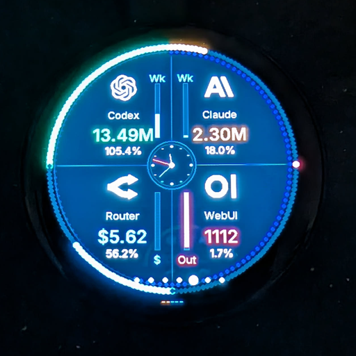

# Token Tracker



Project version: `0.4.0`

Token Tracker is a personal AI-usage display for the Waveshare ESP32-S3 Touch
AMOLED 1.75, Home Assistant and a small VS Code extension.

It is built around my own environment, but the structure can be reused if you
swap out the entity IDs, MQTT settings and API secrets.

## Parts

- `esphome/round-token-tracker.yaml` - the ESPHome display.
- `homeassistant/packages/tokentracker/` - Home Assistant packages for
  OpenRouter and Open WebUI.
- `vscode-extension/` - VS Code extension that publishes local Codex and
  Claude Code token counters to MQTT discovery.

## Versions

- Project: `0.4.0` (`VERSION`)
- ESPHome display: `1.11.0`
- Home Assistant package: `1.2.1`
- VS Code extension: `1.3.1`

See `HISTORY.md` for the change log.

See `INSTALL.md` for a step-by-step installation from an empty Home Assistant /
VS Code / ESPHome environment.

## Data model

The display fetches raw values from Home Assistant and computes max, remaining
and percent itself. Max values are adjusted as config entities on the ESPHome
device.

| Source | HA entity | Responsibility |
| --- | --- | --- |
| Codex | `sensor.tokentracker_vs_code_codex_tokens_week` | The VS Code extension reads local Codex sessions/SQLite and publishes weekly tokens via MQTT |
| Claude Code | `sensor.tokentracker_vs_code_claude_code_tokens_week` | The VS Code extension reads local Claude JSONL logs and publishes weekly tokens via MQTT |
| Open WebUI | `sensor.openwebui_tokens_today` | The HA REST package fetches tokens for today from Open WebUI analytics |
| OpenRouter | `sensor.openrouter_balance_remaining`, `sensor.openrouter_usage_percent` | The HA REST package fetches account credits and usage from OpenRouter |

The VS Code extension is intentionally "raw-only": for Codex and Claude Code it
publishes weekly token values and subfields for input/output/cache/reasoning
where the source provides them. For Codex it also forwards the live
`rate_limits` block from the rollout sessions (`primary` = current 5h window
percent + reset epoch, `secondary` = weekly window percent + reset epoch, plus
`plan_type`). The ESPHome display uses Codex's real 5h/weekly percent and reset
times directly on the Codex screen; Claude's session windows are not exposed by
Anthropic so the ESP keeps deriving Claude's 5h from local baselines anchored
to `Claude 5h Start Hour/Minute`.

When the Codex `primary.resets_at` changes the ESP re-baselines the per-5h
input/output/cached/reasoning breakdown so the token deltas match Codex's own
sliding 5h window. Past `resets_at` epochs zero the corresponding ring so a
long pause from Codex no longer leaves stale percentages on the display.
`tokens left`, usage percent and max limits live in ESPHome/HA so they can be
adjusted on the Token Tracker device.

## ESPHome display

Current ESPHome version: `1.11.0`.

The display shows:

- Clock.
- Codex with input/output/cache/reasoning.
- Claude Code with input/output/cache.
- OpenRouter with account balance, key count, key usage and activity history.
- Open WebUI with input/output, chats, active users and model count.
- Quadrant overview with Codex, Claude Code, OpenRouter, Open WebUI and an
  analog clock.
- I/O Mix with input/output/cache/reasoning across all sources.
- 5h + Week with local 5h values, weekly totals, chats and key count.

Controls:

- Swipe left/right to change screens.
- Tapping an individual provider screen jumps back to the quadrant overview.
- Tapping a quadrant jumps to the matching provider screen.
- A short press on the physical top button pauses/resumes the auto-rotate timer.
- A long press on the top button turns the display off/on.
- `Next Screen` and `Previous Screen` are also available as HA buttons.

Visual rings:

- The outer usage ring shows usage against the max value. For Codex and Claude
  Code it is split: the upper half shows 5h usage and the lower blue half shows
  weekly usage relative to a weekly budget based on the same 5h max.
  OpenRouter and Open WebUI keep their previous full-ring logic.
- The dark-blue inner timer ring shows time remaining until the next
  auto-rotate, and disappears when auto-rotate is paused.
- The clock screen uses the outer ring as a seconds hand.

Important config entities on the ESPHome device:

- `Max Codex per 5h` in ktokens. Used only as a local "what counts as 100%"
  hint for parts of the UI; the real Codex 5h/weekly percentages now come from
  the live Codex `rate_limits` sensors so this slider is mostly cosmetic for
  Codex.
- `Max Claude per 5h` in ktokens. Drives both the Claude 5h ring (`used / max`)
  and the synthetic weekly ring (`week_total / (max × 33.6)`). Calibrate it
  against what Claude Code reports in `Settings → Usage`; there is no public
  Anthropic API for the real Pro/Max limits.
- `Max WebUI` in ktokens.
- `Claude 5h Start Hour` and `Claude 5h Start Minute` — anchors the Claude
  5h baseline rollover. Codex no longer needs these sliders because it
  re-baselines from `codex_5h_resets_at`.
- `Display Brightness Percent`.
- `Screen Interval` for the single screens.
- `Overview Screen Interval` for the quadrant, I/O Mix and 5h + Week screens.
- `Display Rotation`.
- `Auto Orientation`.
- `Auto Rotate Screens`.
- `Show Clock`, `Show Codex`, `Show Claude Code`, `Show OpenRouter`,
  `Show Open WebUI`, `Show Overview`.

Substitutions at the top of `esphome/round-token-tracker.yaml` control the
entity IDs and slider max values. Example:

```yaml
openai_week_tokens_entity: sensor.tokentracker_vs_code_codex_tokens_week
anthropic_week_tokens_entity: sensor.tokentracker_vs_code_claude_code_tokens_week
openwebui_tokens_entity: sensor.openwebui_tokens_today
codex_max_ktokens: "250000"
claude_max_ktokens: "250000"
openwebui_max_ktokens: "1250"
```

## Home Assistant

Copy `homeassistant/packages/tokentracker/` to:

```text
/config/packages/tokentracker/
```

Make sure `configuration.yaml` loads packages:

```yaml
homeassistant:
  packages: !include_dir_named packages
```

Details about secrets, endpoints and sensors are in
`homeassistant/packages/tokentracker/README.md`.

## VS Code extension

The extension is in `vscode-extension/`.

Install a built VSIX via:

```text
Extensions -> ... -> Install from VSIX...
```

Build an installable VSIX when needed with:

```powershell
cd vscode-extension
npm install
npm run compile
npm run package
```

The extension only runs while VS Code is running. It publishes MQTT discovery
and state to the same broker that Home Assistant uses.

## Secrets and repo

This repo should not contain real API keys or tokens. Local files such as
`.ai-tokens`, `.ha-token`, VSIX files, `node_modules`, `dist` and local VS
Code settings are listed in `.gitignore`. Built VSIX files are local artifacts
and should not be checked in.

If this is published, it should be described as an example project or a
reference implementation. Anyone else using it will at least need to change:

- Home Assistant entity IDs.
- MQTT broker and credentials.
- OpenRouter secrets.
- Open WebUI URLs and admin bearer.
- ESPHome Wi-Fi / base configuration.

## Hardware

The configuration is built for the Waveshare ESP32-S3 Touch AMOLED 1.75:

- CO5300 AMOLED, 466x466, QSPI.
- CST9217 touch.
- QMI8658 IMU for auto-orientation.
- GPIO38/4/5/6/7 for the QSPI display.
- GPIO12 CS, GPIO39 display reset.
- GPIO14/GPIO15 I2C.
- GPIO11 touch interrupt, GPIO40 touch reset.

References:

- https://www.waveshare.com/wiki/ESP32-S3-Touch-AMOLED-1.75
- https://devices.esphome.io/devices/waveshare-esp32-s3-touch-amoled-1.75/
- https://esphome.io/components/touchscreen/
